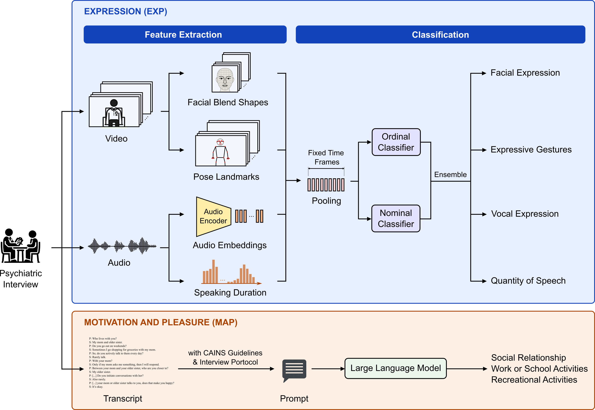

# SchizoNegSympAI

This repository contains the official implementation of the research paper: [**Analyzing Generative AI and Machine Learning in Auto-Assessing Schizophrenia's Negative Symptoms**](https://doi.org/10.1093/schbul/sbaf102).

The study introduces an automated system for the assessment of negative symptoms in schizophrenia based on the Clinical Assessment Interview for Negative Symptoms (CAINS) scale. It evaluates two primary domains:

- **EXP Domain (Expression)**: Extracts and analyzes features from video and audio data using ensemble learning that combines ordinal and nominal classifiers.
- **MAP Domain (Motivation and Pleasure)**: Leverages large language models with zero-shot prompting techniques to analyze clinical interview transcripts.

The results show strong alignment with expert ratings:
- **EXP Assessment (ML-based):** ICC<sub>3,1</sub> = 0.65 and weighted κ = 0.62 (moderate to substantial reliability).
- **MAP Assessment (GenAI-based):** ICC<sub>3,1</sub> = 0.82 and weighted κ = 0.77 (good reliability).



## Repository Structure

```
/
├── assets/                    # Resource files
└── src/  
    ├── core/                  # Shared utilities and helper functions
    ├── ensemble/              # Ensemble learning components
    │   ├── feature_extractor/ # Multimodal feature extraction
    │   │   ├── spkr_diarization.py    # Speaker diarization and separation
    │   │   ├── holistic_tracking.py   # Facial and pose analysis
    │   │   └── encoder.py             # Feature encoding
    │   └── estimator/         # Classification models
    │       ├── train.py               # Training pipeline for ensemble models
    │       └── inference.py           # Assessment using trained models
    ├── llm/                   # LLM-based MAP assessment
    │   ├── transcriber.py     # Audio-to-text transcription
    │   └── estimator.py       # LLM-based assessment logic
    ├── config.yaml            # Configuration file
    └── .env.example           # Environment variable template
```

## Environment Setup

1. Build Docker image:
    ```bash
    docker build --build-arg UID=$(id -u) --build-arg USERNAME=$(whoami) -t schizo-neg-symp-ai:1.0 .
    ```

2. Run Docker container:
    ```bash
    docker run --rm -it -d -v $(pwd):/home/$(whoami)/SchizoNegSympAI --gpus all --name schizo-neg-symp-ai schizo-neg-symp-ai:1.0

    docker exec -it schizo-neg-symp-ai /bin/bash
    ```

3. Copy the environment template:
    ```bash
    cp src/.env.example src/.env
    ```

4. Add API keys in `src/.env`.

5. Configure model parameters in `src/config.yaml`.

## EXP Assessment Pipeline

Evaluates expression-related symptoms (facial expression, vocal expression, expressive gestures, and quantity of speech).

### Feature Extraction

1. Place your audio and video files in `./data/audio` and `./data/video`, respectively. Ensure that the audio and video files for each subject share the same filename.

2. Run speaker diarization:
    ```bash
    python src/ensemble/feature_extractor/spkr_diarization.py ./data/audio
    ```

3. Run pose landmark detection:
    ```bash
    python src/ensemble/feature_extractor/holistic_tracking.py ./data/video
    ```

4. Generate features:
    ```bash
    python src/ensemble/feature_extractor/encoder.py
    ```
    Feature files for each subject will be saved in the directory specified by `ensemble.path.embed_dir` in `src/config.yaml`.

### Training

1. Prepare a ground truth file in the format of `assets/labels.csv`, where "C1" represents the first assessment item in CAINS. Place this file at the path specified by `ensemble.path.label_file` in `src/config.yaml`.

2. Train the ensemble classifiers:
    ```bash
    python src/ensemble/estimator/train.py
    ```
    The trained models will be saved in the folder specified by `ensemble.path.result_dir` in `src/config.yaml`. Each run creates a subfolder named `train_<exp_name>_<timestamp>`, where `exp_name` is set by `ensemble.training.experiment_name` in the config file.

### Inference

Run assessment on new data:
```bash
python src/ensemble/estimator/inference.py --exp-dir </path/to/training_experiment>
```

Results will be saved in the folder specified by `ensemble.path.result_dir` in `src/config.yaml`. Each run creates a subfolder named `inference_<exp_name>_<timestamp>`, where `exp_name` is set by `ensemble.training.experiment_name` in the config file.

## MAP Assessment Pipeline

Assesses motivation-related symptoms (social relationships, work/school activities, and recreational activities) from clinical interview transcripts.

1. Place your audio files in `./data/audio`

2. Transcribe audio to text:
    ```bash
    python src/llm/transcriber.py ./data/audio
    ```
    Transcripts for each subject will be saved in the directory specified by `llm.path.transcript_dir` in `src/config.yaml`.

3. Perform MAP scoring with an LLM:
    ```bash
    python src/llm/estimator.py --model <model_id> [--output-dir </path/to/results>]
    ```
    If `--output-dir` is not specified, results will be saved in the directory specified by `llm.path.result_dir` in `src/config.yaml`. Each run creates a subfolder named `<exp_name>_<timestamp>`, where `exp_name` is set by `llm.estimator.experiment_name` in the config file.

## Acknowledgements

This work builds upon several open-source tools and APIs. We thank the teams behind the following projects for their contributions:

- [Claude 3 Haiku](https://www.anthropic.com/news/claude-3-haiku)
- [fairseq](https://github.com/facebookresearch/fairseq)
- [Gemini API](https://ai.google.dev/gemini-api/docs/models)
- [Hartley Spectral Pooling](https://github.com/AlbertZhangHIT/Hartley-spectral-pooling)
- [GPT-3.5 Turbo](https://platform.openai.com/docs/models/gpt-3.5-turbo)
- [MediaPipe](https://github.com/google-ai-edge/mediapipe)
- [NeMo](https://github.com/NVIDIA/NeMo)
- [Ordinal Classifier](https://github.com/garyongguanjie/Ordinal-Classifier)
- [Random Forest](https://github.com/wangyuhsin/random-forest)
- [Whisper](https://github.com/openai/whisper)

## Citation

```
@article{10.1093/schbul/sbaf102,
    author = {Liu, Chih-Min and Chan, Yi-Hsuan and Ho, Ming-Yang and Liu, Chen-Chung and Lu, Ming-Hsuan and Liao, Yi-An and Hsieh, Ming-Hsien and Tseng, Yufeng Jane},
    title = {Analyzing Generative AI and Machine Learning in Auto-Assessing Schizophrenia’s Negative Symptoms},
    journal = {Schizophrenia Bulletin},
    pages = {sbaf102},
    year = {2025},
    month = {08},
    issn = {1745-1701},
    doi = {10.1093/schbul/sbaf102}
}
```

## License

Licensed under the [MIT License](LICENSE).
